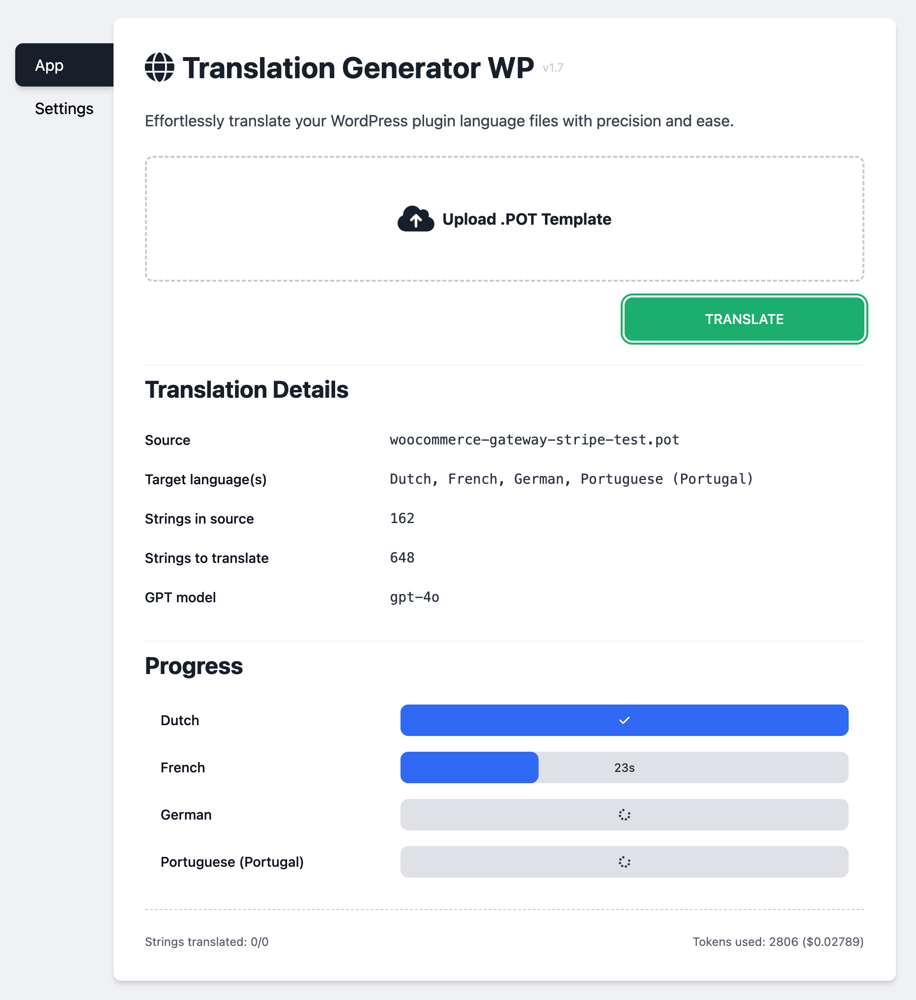
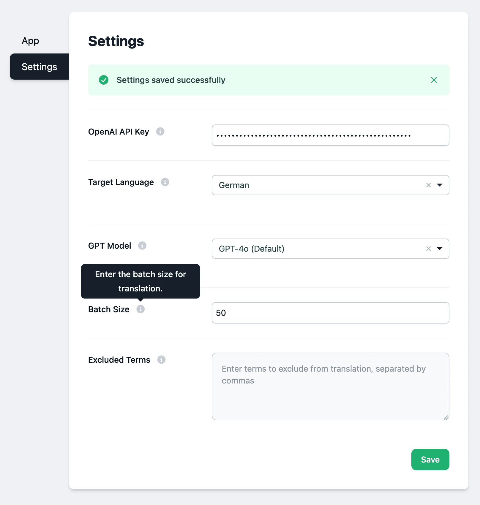

# Translation Generator WP



 

## Project Overview

The Translation Generator WP is a Node.js proof-of-concept project designed to streamline the process of generating translations for WordPress plugins. This tool simplifies the localization process, making it easier for developers and content creators to manage multilingual content.

## Requirements

Before setting up the project, ensure you have the following installed on your system:

- **Node.js**: JavaScript runtime built on Chrome's V8 JavaScript engine.
- **npm**: Node package manager to manage project dependencies.

## Installation

Follow these steps to set up the project:

1. **Clone the repository:**

   ```
   git clone https://github.com/riaanknoetze/translation-generator-wp.git
   cd translation-generator-wp
   ```

2. **Install dependencies:**

   Ensure you have `Node.js` installed on your system. Then run:

   ```
   npm install
   ```

3. **Set up environment variables:**

   [Optional] Create a `.env` file in the root directory of the project and add your OpenAI API Key:

   ```
   OPENAI_API_KEY=sk-123
   ```

   Alternatively, you can configure the API key on the app settings page.

4. **Run the project:**

   Start the node server by running:

   ```
   npm start
   ```

   If you need to run the server with elevated privileges, use:

   ```
   sudo node server.js
   ```

5. **Access the application:**

   Open your web browser and navigate to [http://localhost:3000](http://localhost:3000) to start using the Translation Generator WP.

## Usage

### Configuring Settings

1. Navigate to the "Settings" tab.
2. Enter your OpenAI API Key in the provided input field.
3. Select the target language and GPT model from the dropdown menus.
4. Choose the number of strings (i.e. sentences) to batch before sending to gpt for translation.
4. Click "Save" to apply the settings.

### Uploading a .POT File

1. Navigate to the "App" tab.
2. Click on "Choose .POT File" and select a .POT file from your local system.
3. Once the file is selected, the file name will be displayed, and the "Translate" button will be enabled.

### Translating the File

1. Ensure the target language and model are selected in the "Settings" tab.
2. Enter any terms you want to exclude from translation in the "Excluded Terms" textarea, separated by commas.
3. Click the "Translate" button in the "App" tab.
4. The progress bar will display the translation progress. The translated strings area will show the string translation process.
5. Once completed, the translated file will be automatically downloaded.

## Supported Languages

The application currently supports the following languages:

- English (United States) - `en_US`
- Spanish - `es_ES`
- German - `de_DE`
- French - `fr_FR`
- Italian - `it_IT`
- Portuguese (Portugal) - `pt_PT`
- Russian - `ru_RU`
- Dutch - `nl_NL`
- Japanese - `ja`
- Chinese (Simplified) - `zh_CN`
- Polish - `pl_PL`
- Romanian - `ro_RO`
- Hungarian - `hu_HU`
- Swedish - `sv_SE`
- Finnish - `fi`
- Danish - `da_DK`
- Greek - `el`
- Turkish - `tr_TR`
- Hebrew - `he_IL`
- Korean - `ko_KR`

## Additional Information

* Ensure you have the latest version of Node.js for the best performance and compatibility.
* For detailed information on each dependency, refer to the `package.json` file.
* The application currently supports multiple languages as listed in the language dropdown.
* For support or to report issues, please create an issue in the [GitHub repository](https://github.com/yourusername/translation-generator-wp/issues).

## License

This project is licensed under the MIT License. See the LICENSE file for details.
